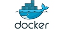
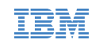
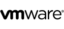
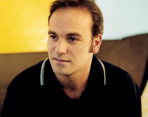

# About

<h3>Corporations Contributing to Cloud Foundry</h3>

<a href="https://github.com/cloudfoundry/cloud_controller_ng/blob/master/CONTRIBUTING.md" target="_blank">Join</a> the other organizations that have signed the corporate contributor's license agreement enabling them to contribute to Cloud Foundry.

<ul>
<li>84codes</li>
<li>Accenture</li>
<li>ActiveState</li>
<li>Altoros</li>
<li>AnyNines</li>
<li>AppFog (Savvis)</li>
<li>Blue Box</li>
<li>Canonical</li>
<li>Canopy</li>
<li>CenturyLink</li>
<li>Cisco</li>
<li>CloudCredo</li>
<li>CloudSoft Corp</li>
<li>DTS Corporation</li>
<li>EMC</li>
<li>Ebay x.commerce</li>
<li>Forio</li>
<li>Huawei</li>
<li>IBM</li>
<li>Innovation Factory</li>
<li>Intalio</li>
<li>Intel</li>
<li>iron.io</li>
<li>Load Impact</li>
<li>Mendix</li>
<li>Neo Technology</li>
<li>Northwest Independent Ruby Development</li>
<li>NTT</li>
<li>OGIS-RI</li>
<li>Orange</li>
<li>Piston Cloud</li>
<li>Pivotal</li>
<li>Rackspace</li>
<li>Rakuten</li>
<li>Redis Labs</li>
<li>SAP</li>
<li>Savvis</li>
<li>Sebula Bilisim Tek. LTD STI</li>
<li>SendGrid</li>
<li>SM-ePaaS, Inc</li>
<li>Stark & Wayne</li>
<li>Swisscom</li>
<li>Symantec</li>
<li>Tier 3</li>
<li>The Church of Jesus Christ of Latter-day Saints</li>
<li>Uhuru Software</li>
<li>Velankani Information Systems</li>
<li>VMware</li>
<li>ZephirWorks</li>
<li>Zhejiang University</li>
</ul>

In the cloud era, the application platform will be delivered as a service, often described as Platform as a Service (PaaS). PaaS makes it much easier to deploy, run and scale applications. Some PaaS offerings have limited language and framework support, do not deliver key application services, or restrict deployment to a single cloud. Cloud Foundry is the industry’s Open PaaS and provides a choice of clouds, frameworks and application services. As an open source project, there is a broad community both contributing and supporting Cloud Foundry.

Open cloud and open source are only part of the transformation underway, there is also a massive narrative building around continuous innovation and high velocity agile development. Some open source projects foster inclusiveness and sacrifice velocity while some increase velocity at the expense of transparency. Cloud Foundry.org’s unique vision is to foster contributions from a broad community of developers, users, customers, partners and ISVs while advancing development of the platform at extreme velocity. Cloud Foundry.org exists to provide a platform for the community of customers, partners and even former competitors to collaborate, teach, share and learn together, accelerating the pace of innovation and contribution.  The best way to [get involved](/get-in) is to [join the conversation](https://groups.google.com/a/cloudfoundry.org/forum/?fromgroups#!forum/vcap-dev), contribute to the [wiki](https://github.com/cloudfoundry-community/cf-docs-contrib/wiki) and [fork the code](https://github.com/cloudfoundry). We call it ‘fierce collaboration’ and we hope you will join us.

 

### Who's Using It

{:.user-table}
|    | Cloud Foundry helped to launch three new products for a major insurance company in just seven months. [Read More](http://blog.cloudfoundry.org/2012/03/22/how-opencredo-launched-three-new-products-in-seven-months-with-cloud-foundry/)  |
|   | Monsanto connected Cloud Foundry to HBase and kicked-off their next generation application and data analytics platform. [Watch](https://www.youtube.com/watch?v=RJCB7OGeY9o&index=23&list=PLAdzTan_eSPQddps0wSNIMaYNYjMLV73X)  |
|  | Cloud Foundry helps Verizon customers speed up application delivery and dynamically scale applications. [Read More](http://newscenter.verizon.com/corporate/news-articles/2013/11-12-open-cloud-innovation-with-pivotal/) |
|  | Cloud Foundry helped SAP to streamline and speed up their development. [Watch](https://www.youtube.com/watch?v=A8kEfY7bA_8&index=17&list=PLAdzTan_eSPQddps0wSNIMaYNYjMLV73X) |
|  | Baidu serves up One Billion page views a day with Cloud Foundry. [Read More](http://www.slideshare.net/wattersjames/baidu-cloudfoundry-english-24626493) |
|  | NTT Communications delivers global cloud services, based on Cloud Foundry, to enterprise customers. [Read More](https://www.youtube.com/watch?v=VWPiI7jKFqM&index=63&list=PLAdzTan_eSPQddps0wSNIMaYNYjMLV73X) |
|  | Rakuten—the Largest E-commerce Company in Japan relies on Cloud Foundry. [Watch](https://www.youtube.com/watch?v=WBGtIZ4WIH4&index=64&list=PLAdzTan_eSPQddps0wSNIMaYNYjMLV73X) |
|  | CoreLogic is building a product and data delivery platform based on Cloud Foundry. [Watch](https://www.youtube.com/watch?v=HZWkfOe1-tc&index=24&list=PLAdzTan_eSPQddps0wSNIMaYNYjMLV73X) |
|  | Bank of New York Mellon's experiences with Cloud Foundry are influencing their strategy. [Watch](https://www.youtube.com/watch?v=eJ1j6qezthY&index=6&list=PLAdzTan_eSPQddps0wSNIMaYNYjMLV73X) |
|  | Swisscom is using Cloud Foundry to help build its future cloud platform. [Watch](https://www.youtube.com/watch?v=fNSgltgW8AA&index=7&list=PLAdzTan_eSPQddps0wSNIMaYNYjMLV73X) |
|  | Cisco discusses their experience with Cloud Foundry. [Watch](https://www.youtube.com/watch?v=peBL1QsZgcg&index=10&list=PLAdzTan_eSPQddps0wSNIMaYNYjMLV73X) |
|  | With Cloud Foundry, Axel Springer realized their vision of an innovative, fully automated service delivery platform by accelerating the time and quantity to market rate and reducing IT costs at the same time. [Watch](https://www.youtube.com/watch?v=GKJ6YgIZm88&index=18&list=PLAdzTan_eSPQddps0wSNIMaYNYjMLV73X) |
|  | The Church of Latter-Day Saints uses Java to build Cloud Foundry components such as service brokers and BOSH to deploy. [Watch](https://www.youtube.com/watch?v=LCC1q6tpawY&index=32&list=PLAdzTan_eSPQddps0wSNIMaYNYjMLV73X) |
|  | Cloud Foundry is helping SAS, a software vendor with 35+ years of industry history, rework its software and business. [Watch](https://www.youtube.com/watch?v=jFt0jp34lqA&index=40&list=PLAdzTan_eSPQddps0wSNIMaYNYjMLV73X) |
|  | Canopy Cloud Fabric offers Cloud Foundry as a managed cloud service for enterprises looking for choice of tenancy, location and hosting options; rock solid enterprise SLAs; and consulting, customisation and developer professional services. [Watch](https://www.youtube.com/watch?v=YMNt6Gn3yaI) |

***

### The Cloud Foundry Foundation

{:.foundation-table}

{:.foundation-p}
Swisscom joins existing Cloud Foundry Foundation members Accenture, ActiveState, Alpine Data Labs, Altoros, Anchora, anynines, AppDynamics, Azul Systems, Blue Box, BNY Mellon, Canonical, Canopy, Capgemini, CenturyLink, CloudCredo, Docker, EMC, Ericsson, GE, HP, IBM, Intel, jFrog, MongoDB, NTT, Piston Cloud Computing, Pivotal, Rackspace, Redis Labs, SAP, Stark & Wayne, Telus, Verizon, and VMware to bring open, multi-cloud platform-as-a-service to enterprise computing. [Read More](http://www.pivotal.io/platform-as-a-service/press-release/06092014-cloud-foundry-foundation-adds-swisscom-to-roster)

***

### Cloud Foundry Foundation Mission Statement

To establish and sustain Cloud Foundry as the global industry standard open source PaaS technology with a thriving ecosystem; to deliver continuous quality, value and innovation to users, operators and providers of Cloud Foundry technology; and, to provide a vibrant agile experience for the community's contributors that delivers the highest quality cloud-native applications and software, at high velocity with global scale.

***

### Cloud Foundry Foundation - Guiding Principles

* Governance By Contribution - Influence within the Foundation is based on contributions.
* IP Hygiene - IP cleanliness must be preserved at all times.
* Equal Opportunity To Participate - Everyone has an equal opportunity to participate in projects.
* No Surprises - Planning processes and project status are open to all.

***

### Cloud Foundry's Community Advisory Board

The CAB’s mission is to foster a healthy, vibrant, collaborative and innovative community and ecosystem around the Cloud Foundry platform and open source project.

This scope includes:

* Feedback on the Cloud Foundry roadmap, along with feature advocacy.
* Advice on the day-to-day operation of the Cloud Foundry project. For example: how to manage pull requests, select committers, track issues, manage CI, and interact with the community at large (through hangouts, IRC, email forums, etc.).
* Feedback on the Cloud Foundry community web site (cloudfoundry.org) and mechanisms for community website contributions.
* Help in establishing agenda and format for future Platform conferences.
* Guidance on the Cloud Foundry charter, including project scope and definition of any ‘cloud profiles’.  

 

#### Chris Ferris

##### Distinguished Engineer and CTO for Cloud Interoperability, Open Technologies, IBM

Chris currently works as an IBM Distinguished Engineer and CTO for Cloud Interoperability in IBM Software Group's Open Technologies organization. He has been involved in the architecture, design, and engineering of distributed systems for most of his 33+ year career in IT and has been actively engaged in open standards and open source development since 1999. He currently provides technical leadership for IBM's engagements in OpenStack and Cloud Foundry, as well as for IBM's participation in open standards activities relevant to Cloud. He enjoys tennis, both as a spectator and as an avid club player.

 
 

#### Jared Wray

##### Chief Technology Officer for CenturyLink Cloud

Jared Wray, Chief Technology Officer for CenturyLink Cloud, is an early cloud pioneer and visionary architect. As founder and CTO of Tier 3, Wray architected the Tier 3 cloud and built it into an industry recognized cloud innovation and performance leader. Tier 3 was acquired by CenturyLink in 2013 and is now the foundation of CenturyLink Cloud. Wray is a respected thought leader in the enterprise cloud services space, having originated the Iron Foundry open source Platform as a Service (PaaS) project. A serial entrepreneur, Wray previously founded Dual, an interactive development agency with clients such as Microsoft and Nintendo.

 

#### Joshua McKenty

##### Co-Founder and CTO, Piston Cloud Computing

Prior to co-founding Piston Cloud Computing, Joshua McKenty was the Technical Architect of NASA's Nebula Cloud Computing Platform and the OpenStack compute components. As a board member of the OpenStack Foundation, Joshua plays an instrumental role in the OpenStack community. Joshua has over two decades of experience in entrepreneurship, management and software engineering and architecture. He was the team lead for the development of the Netscape Browser (vs. 8) as well as AOL's IE AIM toolbar, and a senior engineer at Flock.com. He also led the successful first release of OpenQuake, an open source software application allowing users to compute seismic hazard, seismic risk and the socio-economic impact of earthquakes. In his spare time, Joshua has crafted a handmade violin and banjo, fathered two children, and invented his own juggling trick, the McKenty Madness.

 

#### Catherine Spence

##### Enterprise Architect, IT, Intel

Catherine Spence is an Enterprise Architect and PaaS Lead for Intel IT’s Cloud Computing program. In addition, she runs the technical arm of the Open Data Center Alliance, an industry consortium of over 300 companies, representing over a billion US dollars in IT spend. Catherine has published a number of papers on Cloud Computing and has won an industry EA award for Architectural Excellence. At Intel since 1996, she has also served as Computing Director, Consulting Practice Manager and Senior Software Engineer. Catherine holds degrees in Engineering, Computer Science and Software Engineering from Trinity College and Harvard University.

 
 

#### James Watters

##### Vice President of Product, Marketing, and Ecosystem for Cloud Foundry at Pivotal

James Watters currently leads a twenty person product management, product marketing, business development, and solution engineering organization responsible for Pivotal's Cloud Foundry based enterprise software and SaaS products.

An expert in open cloud technologies, James is the go-to-source for many of the industry’s thought leaders and has been featured in leading publications such as eWeek, Forbes, GigaOm and Wired. He enjoys a popular Twitter following on all things PaaS.

 
 

#### Jeff Hobbs

##### CTO & VP of Engineering, ActiveState

Jeff oversees development of all ActiveState products including the strategy of integrating our products for an end-to-end desktop to cloud experience.

Jeff's current obsession is making Stackato the best private PaaS platform for developers: using any language, any infrastructure, and leveraging open source - so applications deploy and scale in any cloud. Jeff is a contributing author for Perl and Python extensions, is a member of the Tcl Core Team, is co-author of “Practical Programming in Tcl and Tk”, and has been a speaker at Cloud Expo, OSCON, the Tcl Annual Conference, and others.

 

#### Dr. Nic Williams

##### CEO, Stark & Wayne

Dr Nic, and the team at Stark & Wayne, are some of the most prolific contributors to Cloud Foundry, BOSH and the huge ecosystem upon it. He has also authored many of the well-used tools used by Platform Ops to deploy and maintain their Cloud Foundry installations; such as inception-server, bosh-bootstrap and bosh-cloudfoundry.

Dr Nic was formerly the VP of Technology at Engine Yard, one of the original Platform as a Service companies which supported over 2000 companies on AWS. He is now CEO of Stark & Wayne, the consultancy for companies that love Cloud Foundry. In the two roles over the last 3 years he has spoken with authority at over 20 conferences around the world.

Dr Nic has given many talks on running Cloud Foundry with BOSH and on BOSH itself. He is also one of the most active participants of all three Cloud Foundry community mailing lists. Now, a growing number of companies are choosing Stark & Wayne to setup, support and operate their internal Cloud Foundry. He's Australian and thinks he's very funny. Now living in the Bay Area, in disguise as a software person.

 

#### Mark Shuttleworth

##### Canonical

Mark is founder of Ubuntu, a popular free operating system for desktops and servers. Mark leads product strategy and design at Canonical, which sells commercial support for Ubuntu, mainly to large enterprises and governments who deploy it professionally. Canonical also builds many of the unique elements of Ubuntu for desktop, cloud and server deployments. Mark champions design-driven development and has a focus on quality and cadence in the engineering work done at Canonical. After graduating from the University of Cape Town with a degree in finance and information technology, Mark founded Thawte, a company specialising in digital certificates and cryptography. When Thawte was acquired in 1999 by VeriSign, and he founded HBD, an investment company, and setup the Shuttleworth Foundation, which funds innovative change in society by supporting Fellows and investing in their projects. He moved to London in 2001, and began preparing for the First African in Space mission, training in Star City, Russia, and Khazakstan. In April 2002 he flew in space, as a cosmonaut member of the crew of Soyuz mission TM34 to the International Space Station. After a tour of schools in South Africa promoting science and mathematics for aspiring astronauts he started work on Ubuntu.

 

#### Colin Humphreys

##### CEO, CloudCredo

Colin is the CEO at CloudCredo, a consultancy and services organisation focused on Cloud Foundry and BOSH. He previously worked at Carrenza, a London-based service provider, and AppFog. Colin helped to deliver the 2013 Comic Relief donations platform using Cloud Foundry load-balanced across multiple AWS regions and VMWare infrastructure. He led the installation of the first Cloud Foundry to deliver SLA-driven production services, delivers tooling to the Cloud Foundry community, and is a regular conference speaker on PaaS-related topics. He also organises the London PaaS User Group.

 

